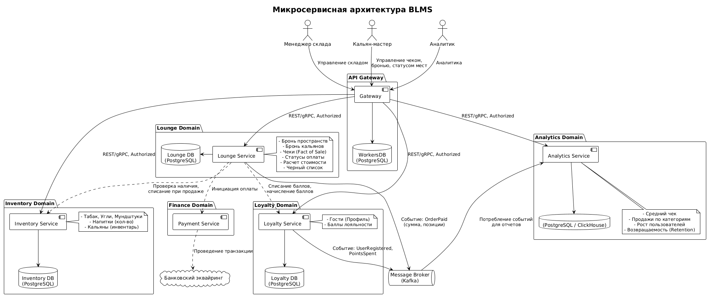

# Описание системы BLMS
## Описание хранимых сущностей
Система должна уметь работать со следующими сущностями:
- Пространство. Можно забронировать на какое-либо количество времени. Имеет уникальное название и статус (свободно, занято).
- Табак для кальяна. Имеет уникальное название, вкус, производителя, описание, крепость, количество грамм табака в упаковке и количество упаковок на складе.
- Кальян. Можно забронировать на какое-либо количество времени. Имеет уникальное название, количество на складе и статус (свободен, занят).
- Угли. Имеют уникальное название, размер грани, количество кубиков в упаковке и количество упаковок на складе.
- Одноразовые мундштуки. Имеют название и количество на складе.
- Напиток. Имеет тип напитка, объем, название, цену и количество единиц напитка на складе.
- Элемент черного списка. Имеет имя заблокированного человека, его фотографию и причину блокировки.
- Факт продажи. Имеет список позиций (напитков, бронь кальянов), дату, рассчитанную стоимость, короткий статус (создан, оплачивается, оплачен, отменен) и текст с дополнительной информацией.
## Менеджер склада
- Может изменить количество исчесляемых сущностей на складе.
- Может добавить определенное количество исчесляемых сущностей на складе.
## Кальян-мастер
- Может поменять статус пространства (освобождать, занимать).
- Может забронировать кальян для гостя на определенное количество времени, что должно быть отражено в чеке.
- Может добавить напиток в чек посетителя.
- Может пометить чек оплаченным, если гости оплатил его наличкой.
- Система должна уметь принимать оплату с карты гостя.
## Программа лояльности
- Для получения скидок гость может зарегестрироваться в программе лояльности.
- За каждую покупку гость получает фиксированное количество баллов.
- Баллы можно тратить при оплате чека, заменяя часть цены в рублях на баллы.
- Для регистрации, пользователю необходимо ввести следующие данные:
  - Номер телефона
  - Имя
  - Пол
  - Дата рождения 
## Сбор статистики
- Статистика изменения среднего чека
- Статистика продаж товаров по категориям (напитки, табак)
- Рост числа пользователей в программе лояльности
- Списания баллов в программе лояльности
- Возвращаемость гостей (по программе лояльности)

# Диаграмма архитектуры
